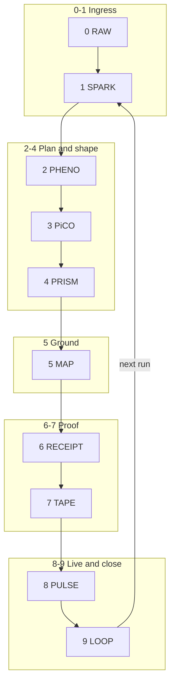

///▙▖▙▖▞▞▙▂▂▂▂▂▂▂▂▂▂▂▂▂▂▂▂▂▂▂///
▛//▞▞ ⟦⎊⟧ :: ⧗-26.053 // WORKBOOK :: ENCODER.ARCHITECTURE ▞▞

```elixir
/// status:[ACTIVE] ver:[1.0.0] created:[26.05.03]
/// doc:[PARTIAL] auth:[3OX.AI]
/// System architecture — 3OX encoder
```

# Encoder — Architecture

## 1. System context

The **encoder** is the subsystem that turns **RAW** input into **grounded, shaped, proven, replayable** output while exposing **live state** and **closed-loop** control. It sits **above** raw OS and **beside** the 3OX cube (Spark … Pulse) already defined in `.3ox/`.



## 2. Component map (repo reality)

| Layer | Logical role | Primary artifacts / paths |
|-------|----------------|---------------------------|
| 0 RAW | Ingress | stdin, uploaded md, chat |
| 1 SPARK | Orientation | `.3ox/(1)Spark/sparkfile.md`, job `command` + `args` |
| 2 PHENO | ρ φ τ plan | EXC `.exc` text, `routes.json` `exc_boundary` |
| 3 PiCO | ⊢⇨⟿▷ | Worker / `.exs`, `run.rb` job runner |
| 4 PRISM | Shape | EXC invariant + presentation templates |
| 5 MAP | Ground | `hex.index.json`, `routes.json`, `slot.index.kdl`, `maps` |
| 6 RECEIPT | Proof of run | `(6)Pulse/runtime/logs/*.json`, future proto `Receipt` |
| 7 TAPE | Ordered memory | **`(6)Pulse/runtime/tape/tape.jsonl`** — append-only, one JSON object per line (receipt proofs). **Jobs queue** remains `runtime/queue/jobs.json` (orchestration), not the proof chain. |
| 8 PULSE | Visibility | `runtime/status.json`, heartbeat in `.3ox/run.rb` |
| 9 LOOP | Stability | supervisor loop + policy reading `last_completed_job` / receipts |

## 3. Data planes

**L1 — TPW signal (continuous)**  
Updates `status.json`; no receipt required per tick.

**L2 — Receipt (discrete)**  
Job completion, validation result, EXC outcome → **RECEIPT** → append **TAPE**.

**Hex plane**  
Line 1 chip `::0xHHH::` → **lookup** `hex.index.json` → optional cluster (`HIRO` / `ME` / core doc paths), `slot`, `route_key`.

## 4. Hashing

- **Internal** (daemon ↔ daemon): **xxh128** — `limits.toml` `[hashing]`.
- **External** (export, third party): **sha256**.

## 5. EXC triple surface (when used)

```text
.exc  = canonical meaning (wins on conflict)
.kdl  = deterministic structure (generated from .exc)
.exs  = behavior / validate-only against boundary
```

## 6. RECEIPT v1 (JSON)

- **Schema:** `_meta/ENCODER.RECEIPT.schema.json`
- **Pulse alignment:** every receipt **includes** `job_id`, `completed_at`, `status`, optional `output_preview` (same keys as `run.rb` → `runtime/logs/<job_id>.json`).
- **Encoder extension:** top-level **`receipt_version`: `"1"`** and **`encoder`** object with **`layer_6_receipt`: true**, **`code_4096`**, and **`map`** (resolved `hex.index.json` + `routes.json` `slot_index` + route keys from `maps.hex`).

## 7. TAPE v1 (`tape.jsonl`)

- **Path:** `.3ox/(6)Pulse/runtime/tape/tape.jsonl` (create directory on first write).
- **Format:** newline-delimited JSON; each line is a full **RECEIPT v1** object (dry-run and tooling use full object for replay clarity).
- **Rule:** append-only; never rewrite earlier lines.

## 8. MAP resolution (deterministic order)

1. Normalize chip to `0xHHH`.
2. Load **`hex.index.json`** → `entries[code]` (owner, title, optional `slot`, `route_key`, …).
3. **`slot_id`** = `entries[code].slot` if present, else `routes.maps.hex[code]` if present, else **null**.
4. If **`slot_index[slot_id]`** exists → attach **`slot_row`**.
5. Collect **`route_keys`**: any key `k` in `routes` where `routes[k]` is an object and `routes[k].slot == slot_id`.

## 9. Gensing vs ClassicMD

- **Gensing:** glyph spine + `::0xHHH::` + `⫸ 〔…〕` context line; dense law headers.
- **ClassicMD GlyphBit:** HIRO seven-section + `.ME` card; unchanged dialect for GlyphBits.

Encoder **does not merge** these in v1; it **routes** by file type and index metadata.

## 10. Extension points

- `hex.index.json` `entries.*` — add `files`, `cluster_role`, `encoder_layer_hooks`.
- `routes.json` — add `encoder` block mirroring this doc for machine consumers.
- Validators in `scripts/` or `.github/workflows/ci.yml`.

---

:: ∎
