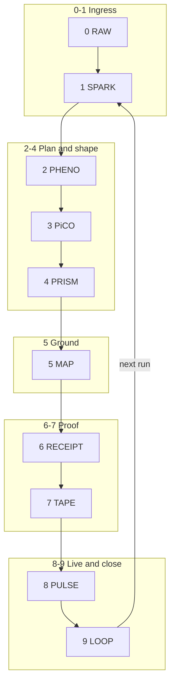

///▙▖▙▖▞▞▙▂▂▂▂▂▂▂▂▂▂▂▂▂▂▂▂▂▂▂///
▛//▞▞ ⟦⎊⟧ :: ⧗-26.053 // WORKBOOK :: ENCODER.ARCHITECTURE ▞▞

```elixir
/// status:[ACTIVE] ver:[1.0.0] created:[26.05.03]
/// doc:[PARTIAL] auth:[3OX.AI]
/// System architecture — 3OX encoder
```

# Encoder — Architecture

## 1. System context

The **encoder** is the subsystem that turns **RAW** input into **grounded, shaped, proven, replayable** output while exposing **live state** and **closed-loop** control. It sits **above** raw OS and **beside** the 3OX cube (Spark … Pulse) already defined in `.3ox/`.



## 2. Component map (repo reality)

| Layer | Logical role | Primary artifacts / paths |
|-------|----------------|---------------------------|
| 0 RAW | Ingress | stdin, uploaded md, chat |
| 1 SPARK | Orientation | `.3ox/(1)Spark/sparkfile.md`, job `command` + `args` |
| 2 PHENO | ρ φ τ plan | EXC `.exc` text, `routes.json` `exc_boundary` |
| 3 PiCO | ⊢⇨⟿▷ | Worker / `.exs`, `run.rb` job runner |
| 4 PRISM | Shape | EXC invariant + presentation templates |
| 5 MAP | Ground | `hex.index.json`, `routes.json`, `slot.index.kdl`, `maps` |
| 6 RECEIPT | Proof of run | `(6)Pulse/runtime/logs/*.json`, future proto `Receipt` |
| 7 TAPE | Ordered memory | **`(6)Pulse/runtime/tape/tape.jsonl`** — append-only, one JSON object per line (receipt proofs). **Jobs queue** remains `runtime/queue/jobs.json` (orchestration), not the proof chain. |
| 8 PULSE | Visibility | `runtime/status.json`, heartbeat in `.3ox/run.rb` |
| 9 LOOP | Stability | supervisor loop + policy reading `last_completed_job` / receipts |

## 3. 3OX.Core{} (27 κ seats)

**3OX.Core{}** = **Axis[3] + Encode[6] + Ring[9] + System[9]** = **27** protected **`κ`** slots (**`k00`..`k26`**) in **`routes.json` → `slot_index`**, with **`routes.json` → `core`** as the human/machine index (grammar: **`3OX.Core{Axis}`** etc.; avoid top-level **`3OX.Axis`**).

| Sector | Seats | Repo role |
|--------|------:|-------------|
| **Core{Axis}** | Warden, Tape, Pulse | **Warden EXC triple:** `.3ox/(3)Rules/exc/Axis.Warden.{exc,kdl,exs}` + `limits.toml` |
| **Core{Encode}** | Intent … Seal | spark, authority, receipt state, MAP, memory index, seal |
| **Core{Ring}** | Intake … Recover | encoder layers **0–9** as the operational ring |
| **Core{System}** | Meta … Patch (Anchor 2 / Control 4 / Seal 3) | `_meta`, `_TRON`, policy, daemon, cage, links, hash policy, vault, patch |

**Larger ladder (policy):** 27 Core → 81 route ring → 216 ξ cube → **243** envelope (216+27) → **729** archive — see **`_meta/3OX.CORE.RESEARCH.md`**.

**Proof only:** **Leo** (`E101`, `0x101`) is a **ξ** GlyphBit path to validate the encoder; it is **not** a **`κ`** Core seat.

## 4. Data planes

### 4.1 TPW rotor (Axis triad — continuous)

**L1 — TPW signal (continuous)**  
Updates `status.json`; no receipt required per tick.

**L2 — Receipt (discrete)**  
Job completion, validation result, EXC outcome → **RECEIPT** → append **TAPE**.

**Hex plane**  
Line 1 chip `::0xHHH::` → **lookup** `hex.index.json` → optional cluster (`HIRO` / `ME` / core doc paths), `slot`, `route_key`.

- **Canonical EXC (machine):** `.3ox/(3)Rules/exc/Axis.Warden.exc` (+ `.kdl`, `.exs` shim) — **`exc_validate`** target.
- **Gensing-format job specs (Markdown):** `.3ox/(3)Rules/exc/tpw/*.spec.md` — line-1 **`::0x000::` … `::0x003::`**, **`⫸`** context, **`▞▞ JOB`** per block; hex rows **`0x000`–`0x003`** in **`hex.index.json`**. Spin order in doc: **k00 Warden → k01 Tape → k02 Pulse** (matches **`core.axis`** map).

- **Center 0/1 flip?** Not mandatory in schema. If you want a **single bit** of “phase” for diagrams, treat it as **parity of ticks** or a **`status.json` field** you own — it is **telemetry**, not a second truth source. The **stream-of-consciousness** picture fits **L1**: lots of small updates; **collapse** (L2 **RECEIPT**) only when something **must** be witnessed (job done, validation, seal).

### 4.2 “5 ring” vs **Core{Ring}[9]** vs **18**

These are **different counts**; same page if we name them:

| Name | Count | What it is |
|------|------:|------------|
| **TPW + PiCO spine (encode lane)** | **3 + 4 = 7** | Axis triad **+** four PiCO moves (⊢⇨⟿▷) as the **tight** “turn intent into motion” spine (often drawn as one compact ring in diagrams). |
| **Core{Ring}** (κ seats **k09–k17**) | **9** | **One** full operation sequence in **3OX.Core{}**: Intake → … → Recover — **authoritative** in `routes.json`. |
| **18** | **9 + 9** | **Not** a third ring of seats: it is a **useful narrative** = run the **nine** once for **encode / draft**, then run the **nine** again for **commit / seal** (two **passes** over the same ring, two **receipts** if you want proof). **27** stays the **Core{} chamber** size. |

So: **TPW powers the cheap continuous side**; the **nine** is the **discrete law path**; **“18”** = **two passes** of that path when you separate **draft** from **commit**, not **9+9 new slots**.

### 4.3 Encoder → inference (pre-feed / automate before ask)

The encoder **should** push a **thin stream** upstream of the model: **MAP-resolved** one-liners (hex row, slot, last receipt digest, pulse mode) so **inference** can stay **single-slot** and **low-token** — work is **prepared** before the user “asks,” without pretending the model already ran the full job.

## 5. Hashing

- **Internal frame:** **xxh3** — fast local integrity (3OX Core research).  
- **Inter-daemon (legacy / wire):** **xxh128** — `limits.toml` `[hashing].internal_daemon` until unified.  
- **External boundary:** **sha256** — `limits.toml` `[hashing].external_boundary`.

## 6. EXC triple surface (when used)

```text
.exc  = canonical meaning (wins on conflict)
.kdl  = deterministic structure (generated from .exc)
.exs  = behavior / validate-only against boundary
```

## 7. RECEIPT v1 (JSON)

- **Schema:** `_meta/ENCODER.RECEIPT.schema.json`
- **Pulse alignment:** every receipt **includes** `job_id`, `completed_at`, `status`, optional `output_preview` (same keys as `run.rb` → `runtime/logs/<job_id>.json`).
- **Encoder extension:** top-level **`receipt_version`: `"1"`** and **`encoder`** object with **`layer_6_receipt`: true**, **`code_4096`**, and **`map`** (resolved `hex.index.json` + `routes.json` `slot_index` + route keys from `maps.hex`).

## 8. TAPE v1 (`tape.jsonl`)

- **Path:** `.3ox/(6)Pulse/runtime/tape/tape.jsonl` (create directory on first write).
- **Format:** newline-delimited JSON; each line is a full **RECEIPT v1** object (dry-run and tooling use full object for replay clarity).
- **Rule:** append-only; never rewrite earlier lines.

## 9. MAP resolution (deterministic order)

1. Normalize chip to `0xHHH`.
2. Load **`hex.index.json`** → `entries[code]` (owner, title, optional `slot`, `route_key`, …).
3. **`slot_id`** = `entries[code].slot` if present, else `routes.maps.hex[code]` if present, else **null**.
4. If **`slot_index[slot_id]`** exists → attach **`slot_row`**.
5. Collect **`route_keys`**: any key `k` in `routes` where `routes[k]` is an object and `routes[k].slot == slot_id`.

## 10. Gensing vs ClassicMD

- **Gensing:** glyph spine + `::0xHHH::` + `⫸ 〔…〕` context line; dense law headers.
- **ClassicMD GlyphBit:** HIRO seven-section + `.ME` card; unchanged dialect for GlyphBits.

Encoder **does not merge** these in v1; it **routes** by file type and index metadata.

## 11. Extension points

- `hex.index.json` `entries.*` — add `files`, `cluster_role`, `encoder_layer_hooks`.
- `routes.json` — add `encoder` block mirroring this doc for machine consumers.
- Validators in `scripts/` or `.github/workflows/ci.yml`.

---

:: ∎
